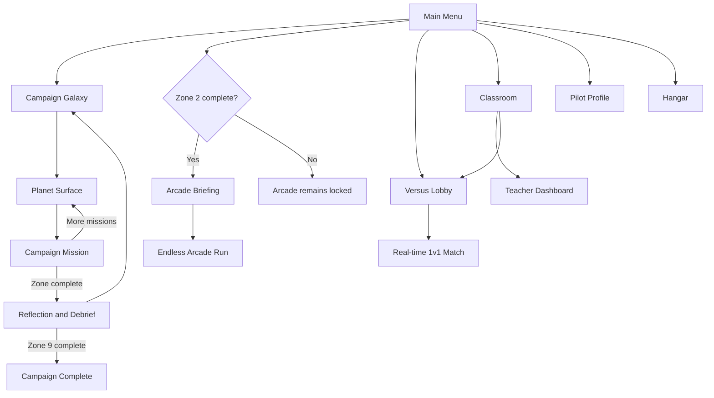
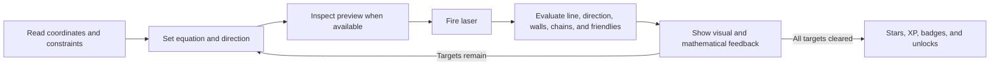
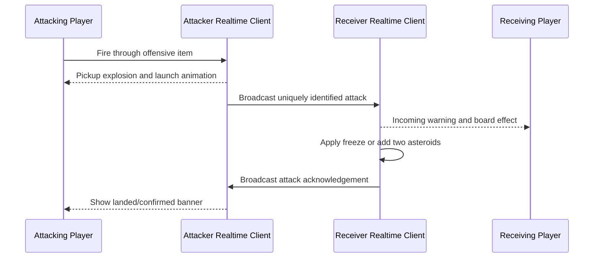

# Slope Invaders: Current Game Implementation and Flow

> **Purpose:** This document is a detailed source-of-truth brief for an AI agent that needs to create a project presentation about the game.
>
> **Snapshot date:** June 13, 2026  
> **Product name shown in the game:** **Slope Invaders**  
> **Repository folder:** `SlopeBlasters`  
> **Source of truth:** The current application code, not the older README or planning documents.

## 1. Executive Summary

Slope Invaders is a browser-based educational action game for learning and practicing linear equations. The player controls a space cannon by changing the equation of a line. The line becomes the cannon's firing trajectory, and the player must use it to hit asteroid weak points while handling increasingly complex constraints.

The central interaction is:

1. Read target coordinates and the mission objective.
2. Set the slope, y-intercept, cannon position, and firing direction as allowed.
3. Use the trajectory preview when the mission provides one.
4. Fire the laser.
5. Observe what the line hit, missed, or was blocked by.
6. Read mathematical feedback.
7. Revise the equation and try again.

The game currently contains three modes:

| Mode | Current status | Purpose |
| --- | --- | --- |
| Campaign | Fully implemented | A 45-mission progression from basic slope to typed equation composition |
| Arcade | Fully implemented and campaign-gated | Endless, increasingly difficult transfer practice |
| Versus | Implemented; requires Classroom cloud setup | Real-time 1v1 racing with offensive item pickups |

The current Campaign contains a tutorial and nine instructional zones. It progresses from `y = mx`, to `y = mx + b`, to all four quadrants, environmental constraints, horizontal cannon movement, and finally direct equation entry in `y = m(x - h) + b` form.

The game also includes:

- Performance-based difficulty adaptation
- Stars, XP, ranks, badges, cosmetics, and a hangar
- A persistent pilot profile
- A calculator and remappable keyboard controls
- Account-free classroom joining and teacher dashboards through Supabase
- Same-class Versus matchmaking
- Visual and accessible feedback for Versus item attacks
- Local-first progress storage with best-effort cloud synchronization

## 2. Product Identity

### Player-facing premise

The player is a space pilot using algebra as a targeting system. Asteroid weak points appear on a coordinate grid, and the player's equation determines the path of a laser beam.

The main-menu tagline is:

> Graph the line. Blast the asteroids. Master y = mx + b.

### Intended audience

The content and interaction design are aimed at students learning linear equations, especially middle-school and early high-school algebra learners. The later campaign asks for precision, multi-step reasoning, and direct equation composition appropriate for high-school practice.

### Core learning objectives

The implemented curriculum develops the player's ability to:

- Interpret slope as rise over run
- Compare steep and shallow slopes
- Use fractional and negative slopes
- Understand the y-intercept as a vertical shift
- Work across all four quadrants
- Distinguish the infinite mathematical line from the cannon's firing direction
- Select valid equations under geometric constraints
- Recognize that two points determine one line
- Consider the complete path of a line, not only its target
- Use point-slope-style anchoring through a horizontally moved cannon
- Compose and type equations without relying on an aiming preview

## 3. Technology and Application Structure

### Core stack

- React 19
- TypeScript 6
- Vite 8
- React Konva and Konva for the interactive game board
- `expr-eval` for calculator expressions and typed equation values
- Supabase for Classroom and Versus cloud features
- Vitest and jsdom for automated tests
- A custom global CSS visual system rather than a component framework

### High-level architecture

| Area | Responsibility |
| --- | --- |
| `src/app/App.tsx` | Application shell, screen-state routing, settings, music, and mode transitions |
| `src/game/Game.tsx` | Main Campaign mission engine and learning loop |
| `src/game/logic/` | Pure equation, collision, scoring, and feedback logic |
| `src/game/components/` | Konva board objects and DOM controls |
| `src/game/campaign/` | Zones, levels, adaptivity, stars, XP, badges, cosmetics, and profile data |
| `src/game/arcade/` | Endless-mode spawning, timing, scoring, records, and UI |
| `src/game/versus/` | Seeded 1v1 fields, real-time state, items, attacks, and match flow |
| `src/cloud/` | Device identity, Classroom RPC calls, cloud sync, and Supabase client |
| `supabase/migrations/` | Classroom, Versus, and adaptive-dashboard database schema |
| `src/styles/global.css` | Responsive layout, tactical visual language, animations, and accessibility states |

The application uses internal React screen state instead of React Router. Major screens are lazy-loaded so that large Konva and Supabase code paths do not all enter the initial bundle.

## 4. Complete Player Journey

### First launch

The player arrives at the main mode-selection screen. It presents:

- Campaign
- Arcade
- Versus
- Briefing/help content
- Hangar
- Classroom
- Pilot Profile
- Settings

Campaign is immediately available. Arcade is visibly locked until every available Campaign zone is complete. Versus can be opened, but a playable match requires the cloud configuration, a joined class, and a cadet name.

### Starting Campaign

1. The player enters the Galaxy view.
2. A planet dial shows instructional zones as planets.
3. The player enters a planet surface to view its missions.
4. Locked, ready, and cleared missions are visually distinguished.
5. Selecting a mission triggers a short fade or launch transition.
6. The mission opens in the main game engine.

The player can switch from the Galaxy presentation to a more conventional zone-and-level list.

### Starting a mission

For a normal mission, the current implementation shows a one-time objective briefing for that level. It contains the level title and learning goal and requires the player to begin. Once acknowledged, it is remembered in local storage and is not repeatedly shown on later attempts.

The tutorial uses a guided tour instead of the normal objective briefing.

There is **no separate mission-planning system** in the current implementation. The pre-mission content is a read-only objective briefing, not a plan builder or strategy-selection step.

### During a mission

The screen combines:

- The coordinate-grid game board
- Mission objective
- Current equation
- Allowed equation controls
- Fire button
- Hearts
- Score and target progress
- Hint and result feedback
- Calculator access
- Settings access

The player changes the equation, previews the resulting line when allowed, and fires. The beam animates across the board. The engine evaluates asteroids, barriers, chains, friendlies, direction, and board boundaries, then returns explanatory feedback.

### Completing a mission

When all targets are destroyed, the completion overlay reports:

- Shots
- Score
- Star rating
- XP earned
- Why the XP was earned
- Newly earned badges
- Newly unlocked cosmetics

The player can replay the mission or continue. Progress records the best result rather than punishing later experimentation.

### Completing a zone

The final mission in a zone leads to a learning check rather than immediately crossing into the next zone. Zones contain:

- Multiple-choice reflection questions with explanations
- Open-ended debrief prompts

After the debrief, the player returns to the Galaxy. The next zone is unlocked by completing the previous zone.

### Completing Campaign

After the Zone 9 debrief, the player sees the Campaign completion screen with:

- Celebration effects
- Total levels cleared
- Stars earned
- Lifetime accuracy
- Total shots
- A non-destructive Campaign replay option

Completing Zone 2 unlocks Arcade. Full Campaign completion still leads to the Campaign finale but is not required for Arcade.

## 5. Core Mathematical Game Model

### Coordinate system

The campaign begins in Quadrant I and later expands to all four quadrants. Asteroids expose weak points at exact graph coordinates. Coordinates are normally visible, although scaffolding can vary by level and adaptive tier.

The standard Campaign board is rendered at 560 by 560 logical pixels and scales responsively in the interface.

### Supported equation forms

#### Slope-only form

```text
y = mx
```

Used in the tutorial, positive-slope training, and negative-slope training.

#### Slope-intercept form

```text
y = mx + b
```

Used once the y-intercept is introduced and throughout most of the middle campaign.

#### Cannon-anchor or point-slope-style form

```text
y = m(x - h) + b
```

Here:

- `m` is slope
- `h` is the cannon's horizontal position
- `b` is the line's height at the cannon's position

This representation supports the moving-cannon mechanic. Algebraically, it still describes a standard straight line because it can be expanded to `y = mx + (b - mh)`.

### Firing direction

The equation describes an infinite line, but the weapon fires only in the selected direction.

- Facing right reaches points ahead of the cannon on the right.
- Facing left reaches points ahead of the cannon on the left.
- The rendering and hit logic mirror the effective trajectory appropriately.

This mechanic makes the player reason about both the equation and the ray-like direction of the shot.

### Hit detection

An asteroid is hit when:

- Its weak point lies on the fired line within a vertical tolerance of `0.35` graph units.
- It is in front of the cannon in the selected direction.
- A wall does not intercept the beam before the asteroid.
- A friendly ship is not intersected by the shot.
- Any linked-group requirement is satisfied.
- In sequential missions, the asteroid is the currently active target.

The beam endpoint is determined by the nearest blocking event or the edge of the graph.

### Shots and hearts

Campaign missions have finite hearts but generally unlimited possible shots. A shot costs a heart when it destroys no valid target. This includes:

- A normal miss
- Firing off the board
- Being blocked before reaching a target
- Hitting a friendly
- Hitting only part of a linked group

The player loses when hearts reach zero and can retry immediately without losing permanent progression.

### Score

An asteroid is worth 100 base points. Hitting multiple asteroids with one shot creates a combo bonus:

- First asteroid: base value
- Each additional asteroid in the same shot: an additional 50-point bonus

## 6. Controls and Input

### On-screen controls

Depending on the mission, the player can change:

- Slope
- Y-intercept
- Cannon x-offset
- Firing direction

Slope and y-intercept steppers move in increments of `0.5`. Cannon x-offset moves in increments of `1`. Values can also be entered directly through the displayed controls.

### Default keyboard controls

| Action | Default key |
| --- | --- |
| Fire | Space |
| Increase slope | R |
| Decrease slope | F |
| Increase y-intercept | W |
| Decrease y-intercept | S |
| Move cannon right | D |
| Move cannon left | A |
| Face left | Q |
| Face right | E |

These controls are remappable in Settings. The remapping interface detects conflicts rather than silently assigning one key to two actions.

### Global shortcuts

- `?` opens the keyboard-shortcuts overlay.
- `S` opens Settings outside gameplay.
- `P` opens the Pilot Profile outside gameplay.
- Standard keyboard navigation includes Tab, Shift+Tab, Enter, and Escape.

Gameplay shortcuts are suspended when settings or blocking dialogs are active.

### Typed equation entry

Zone 9 replaces numerical steppers with typed equation slots. The player can enter:

- Integers
- Decimals
- Fractions such as `1/2`
- Negative values

Expressions are parsed with `expr-eval`. Fire remains disabled until all required visible slots contain valid values. Direction remains an ordinary control.

## 7. Board Objects and Constraints

### Asteroids

Each asteroid has a weak-point coordinate. Some asteroids are independent, while others belong to a linked group.

### Walls and shields

Walls are line segments. If the fired beam intersects a wall before reaching its target, the beam stops at the wall. These obstacles force the player to find a different valid line or move the cannon.

### Linked asteroids

Linked asteroids are an all-or-none challenge. Every asteroid in a link group must be hit by the same shot. Hitting only one member does not destroy the group and costs a heart.

This mechanic directly operationalizes the idea that two points determine a single line.

### Friendly ships

Friendly ships occupy points along possible trajectories. If the shot intersects a friendly, the entire shot is invalidated and costs a heart, even if it would also have hit an asteroid.

This forces the player to consider the complete path of the line rather than matching only the target coordinate.

### Sequential targets

Some missions present multiple asteroids but allow only the current target to count. This focuses attention on one equation at a time and prevents accidental clearing of later targets.

### Moving cannon

The x-offset control slides the cannon horizontally. This changes:

- The shot's starting position
- Which targets are ahead of the cannon
- The displayed anchored equation
- Whether a fixed line can be fired from beyond a wall

## 8. Feedback and Learning Support

### Trajectory preview

The preview line makes the equation visible before firing. Its availability can be:

- Always visible
- Visible but dimmed
- Revealed only after firing
- Off

Mastery and capstone missions reduce or remove the preview to test independent equation reasoning.

### Shot feedback

After firing, the feedback system can explain:

- Which coordinate was hit
- The y-value produced by the player's equation at a target x-value
- Which target was closest to the line
- How far above or below the target the line passed
- Whether slope or intercept should increase or decrease
- Whether the beam was blocked
- Whether a friendly invalidated the shot
- Whether only part of a chain was hit
- Whether the beam left the board without a valid hit

The feedback is diagnostic rather than merely reporting "correct" or "incorrect."

### Calculator

The player can open a movable, non-modal calculator during missions. It:

- Uses expression parsing
- Can evaluate arithmetic and fractions
- Does not pause or replace the board
- Does not reduce score or XP
- Remembers its position

Calculator use is intentionally excluded from adaptive performance scoring.

### Tutorial

The tutorial guided tour contains nine steps:

1. Grid
2. Mission
3. Command Center
4. Keyboard
5. Calculator
6. Hearts
7. Score and Progress
8. Hints and Feedback
9. Ready

The tour is remembered per device.

## 9. Campaign Structure

### Progression rules

- The Campaign has **45 missions**.
- Maximum available Campaign stars are **135**.
- The tutorial contains one mission.
- Zone 1 contains four missions.
- Zones 2 through 9 contain five missions each.
- Zones unlock sequentially.
- Within a zone, the first mission is available when the zone unlocks.
- Later missions unlock after the preceding mission is completed.
- Replaying completed missions never removes progress.

### Full campaign map

#### Tutorial: Meet Your Cannon

**Theme:** Learn the basic interaction with `y = mx`.

| Mission | Subtitle | Main implementation focus |
| --- | --- | --- |
| Tutorial Shot | Aim with slope | Guided introduction to the grid, slope control, preview, firing, feedback, hearts, score, and calculator |

#### Zone 1: Slope Training

**Theme:** Slope as rise over run  
**Equation:** `y = mx`  
**Controls:** Slope only  
**Grid:** Quadrant I

| Mission | Subtitle | Main implementation focus |
| --- | --- | --- |
| Steeper Lines | Larger slope = steeper | Compare positive integer slopes |
| Fractional Slopes | Flatter lines (m = 1/2) | Use shallow fractional slopes |
| Mixed Slope Practice | One target at a time | Sequential slope selection |
| Zone 1 Mastery Check | No preview - prove it | Reduced-preview independent slope reasoning |

#### Zone 2: Intercept Training

**Theme:** Meet the y-intercept (`b`)  
**Equation:** `y = mx + b`  
**Controls:** Slope and y-intercept  
**Grid:** Quadrant I

| Mission | Subtitle | Main implementation focus |
| --- | --- | --- |
| Lift Off the Origin | Raise b to lift the line | Move a line vertically |
| Flat Lines | Horizontal lines (y = b) | Use slope zero and set height with `b` |
| Same Slope, New Height | Same m, different b | Preserve slope while changing intercept |
| Read the Line | Pick m and b - one at a time | Sequentially infer both parameters |
| Zone 2 Mastery Check | No preview - find the line | Independent slope-intercept reasoning |

#### Zone 3: Negative Slopes

**Theme:** Lines that fall  
**Equation:** `y = mx`  
**Controls:** Slope only  
**Grid:** Quadrant IV

| Mission | Subtitle | Main implementation focus |
| --- | --- | --- |
| Lines That Fall | Tilt the line downward | Introduce negative slope |
| Steeper Descents | Bigger slope, faster fall | Compare negative-slope magnitudes |
| Half Steps Down | Fractional negative slopes | Combine sign and fractional steepness |
| Mixed Descents | One target at a time | Sequential negative-slope practice |
| Zone 3 Mastery Check | No preview - prove it | Independent negative-slope reasoning |

#### Zone 4: Four Quadrants

**Theme:** The full coordinate grid  
**Equation:** `y = mx + b`  
**Controls:** Slope, y-intercept, and direction  
**Grid:** All four quadrants

| Mission | Subtitle | Main implementation focus |
| --- | --- | --- |
| All Four Quadrants | Slope aims up/down, facing picks the side | Separate slope sign from firing side |
| Off the Origin | Shift the aim with b | Use intercept on a full grid |
| Read the Quadrant | Pick slope, intercept, and side | Coordinate all three controls |
| Crossfire | More targets, one at a time | Sequential multi-quadrant practice |
| Zone 4 Mastery Check | No preview - prove it | Full-grid independent targeting |

#### Zone 5: Shields and Walls

**Theme:** Constraints force better lines  
**Equation:** `y = mx + b`  
**New object:** Blocking wall segments

| Mission | Subtitle | Main implementation focus |
| --- | --- | --- |
| Shields Up | A wall blocks the easy shot | Introduce beam obstruction |
| Pick the Angle | Flat shots get blocked | Choose a sloped alternative |
| Many Lines, Few Valid | Most equations are blocked | Search among mathematically valid but physically constrained lines |
| Boxed In | Only one or two lines work | Narrow the valid solution set |
| Zone 5 Mastery Check | No preview - thread the shields | Solve constraints without aiming support |

#### Zone 6: Linked Asteroids

**Theme:** Two points determine one line  
**New object:** All-or-none linked groups

| Mission | Subtitle | Main implementation focus |
| --- | --- | --- |
| Linked Up | One line through both | Introduce a two-point chain |
| Chain Gang | A chain on each side | Combine chains with direction |
| Mixed Cargo | Chains and loners together | Distinguish grouped and independent targets |
| Chained and Walled | A shield guards a loner | Combine line uniqueness and barriers |
| Zone 6 Mastery Check | No preview - read every chain | Solve linked targets independently |

#### Zone 7: Friendly Ships

**Theme:** Mind the whole line of fire  
**New object:** Friendly ships that invalidate a shot

| Mission | Subtitle | Main implementation focus |
| --- | --- | --- |
| Hold Your Fire | An ally sits on the easy line | Introduce friendly avoidance |
| Crowded Space | Allies shadow the lazy shots | Reject convenient but unsafe equations |
| Escort | A chain with an ally nearby | Preserve a two-point line while checking its path |
| Gauntlet | Wall, ally, and a chain | Combine multiple environmental constraints |
| Zone 7 Mastery Check | No preview - protect the allies | Apply complete-path reasoning independently |

#### Zone 8: Moving Cannon

**Theme:** Slide the cannon with `y = m(x - h) + b`  
**Controls:** Slope, y-intercept, x-offset, and direction  
**New mechanic:** Horizontal cannon movement

| Mission | Subtitle | Main implementation focus |
| --- | --- | --- |
| Slide the Cannon | Move past the shield, then fire | Move the launch point beyond a wall |
| Reposition | Slide to bring targets into range | Change which targets are in front of the cannon |
| Around the Shield | A chain blocked from the origin | Preserve the chain's unique line but fire it from a new position |
| Full Arsenal | Wall, chain, ally, and x-offset | Combine all major mechanics |
| Final Mastery Check | No preview - prove the whole course | Independent cumulative application |

#### Zone 9: Equation Forge

**Theme:** Type the equation `y = m(x - h) + b`  
**Input:** Typed values rather than steppers  
**Preview:** Locked off at every adaptive tier

| Mission | Subtitle | Main implementation focus |
| --- | --- | --- |
| Transmission Check | Type values to aim | Learn typed slots, fractions, and commit behavior |
| No Cheap Shots | Flat lines are blocked | Type sloped alternatives around shields |
| Precision Quarters | Fractions are required at distance | Use exact fractional slope at long range |
| Relocate and Solve | Slide the cannon past the shield | Type an anchored equation with horizontal offset |
| Forge Mastery | The typed composition capstone | Combine typed equations, chains, walls, friendlies, direction, and repositioning |

## 10. Adaptivity and Personalization

### Adaptive tiers

The Campaign supports three hidden instructional tiers:

- `support`
- `standard`
- `challenge`

The first mission of each zone is fixed at the standard tier and acts as a local diagnostic. Later adaptive missions use prior performance from the same zone.

### Performance calculation

The adaptive score combines:

- 60% shot efficiency and accuracy
- 30% hearts retained
- 10% whether the player avoided losing

Calculator use and control adjustments are not treated as failure signals.

The system applies an exponential moving average with an alpha of `0.6` so recent performance matters more while one unusual mission does not completely determine the next tier.

### Thresholds

- Challenge at or above `0.75`
- Support at or below `0.45`
- Standard in the middle

The middle band acts as a deadband and reduces rapid tier switching.

### Tier effects

Support can provide:

- One additional heart
- A stronger trajectory preview
- Visible coordinates

Challenge can provide:

- One fewer heart
- A reduced preview rung
- Authored target variants in selected missions

The preview ladder is:

1. Always visible
2. Always visible but dimmed
3. Visible only after firing
4. Off

Some levels lock the preview so adaptivity cannot restore it. Zone 9 is the primary example.

### Learner presentation

The player is not labeled as a "support student" or "challenge student." The adjustment is embedded in mission configuration. Adaptivity decisions are stored in a trace for transparency and can appear in teacher data as a tier and reason.

## 11. Stars, XP, Ranks, Badges, and Cosmetics

### Stars

Each completed mission awards one to three stars:

- **3 stars:** No misses, no hearts lost, and full hearts retained
- **2 stars:** No more than one miss
- **1 star:** Mission completed

Only the best star result is retained.

### XP

Campaign XP can be earned for:

- Mission completion: 50 XP
- First-shot hit: 25 XP
- No-miss run: 50 XP
- Multi-hit event: 30 XP per event
- Completing a no-preview mission: 50 XP
- Improvement or comeback: 20 XP

XP is best-run banked per mission. Replaying a mission only adds the difference between the new XP result and the previous best. This prevents repetitive farming while still rewarding improvement.

Arcade also awards lifetime XP based on score:

```text
floor(score / 50)
```

The no-preview Arcade modifier multiplies that award by `1.5`.

### Ranks

| Rank | XP threshold |
| --- | ---: |
| Cadet | 0 |
| Pilot | 500 |
| Ace | 1,500 |
| Commander | 3,000 |
| Star Legend | 5,000 |

### Badges

There are 14 implemented badges:

- Nine zone-concept badges
- Perfect Trajectory
- Combo Pilot
- No Preview Pilot
- Comeback Cadet
- Growth Streak

### Cosmetics

There are 16 implemented cosmetics: six ship hulls, five laser styles, and five themes. They are visual only and do not alter collision, score, adaptive tier, or mathematical difficulty.

#### Ship hulls

- Scout, default
- Falcon, Zone 1
- Crimson Diver, Zone 3
- Azure Lance, Zone 5
- Nebula Wing, Zone 7
- Golden Phantom, Zone 9

#### Laser styles

- Cyan Bolt, default
- Ember Lance, Zone 2
- Plasma Coil, Zone 6
- Verdant Ray, 1,200 XP
- Solar Flare, Perfect Trajectory badge

#### Themes

- Deep Space, default
- Aurora, Zone 4
- Inferno, Zone 8
- Void Bloom, 24 stars
- Solaris, 2,500 XP

The Hangar allows the player to inspect and equip unlocked items. The equipped theme changes application colors and the Campaign board background. Equipped ship and beam styles are passed into Campaign gameplay.

## 12. Pilot Profile

The Pilot Profile summarizes:

- Current rank and XP
- Stars earned out of total available
- Concept, performance, and growth badges
- Cosmetic unlock count
- Lifetime accuracy
- Planet or zone mastery
- Total missions and flight statistics
- Arcade personal records

The profile is personal and device-centered. It is not a public leaderboard.

## 13. Arcade Mode

### Unlock condition

Arcade becomes available only after every available Campaign zone is complete. The application does not currently provide a bypass.

### Run setup

Before starting, the player sees an Arcade briefing and can enable:

- **No Aim Preview**, which disables the aiming line and grants a 50% Arcade XP bonus

A three-second countdown precedes the run.

### Core loop

- The player starts with three shields.
- Each wave contains five threats.
- Asteroids spawn in columns on either side of the board.
- Asteroids alternate between holding and descending.
- A missed shot resets the streak but does not reduce shields.
- An asteroid crossing the danger boundary causes a breach, removes a shield, and resets the streak.
- The run ends when all shields are gone.

### Difficulty escalation

- The initial hold time is 5,000 milliseconds.
- Hold time drops by 250 milliseconds per wave.
- The minimum hold time is 2,750 milliseconds.
- One asteroid can be active initially.
- From Wave 3, up to two asteroids can be active.
- From Wave 4, asteroids can spawn with local orbital walls.
- Wall probability rises in later waves.

The collision system predicts asteroid motion over the laser's 700-millisecond travel animation, so a shot can hit a moving asteroid where it will be rather than only where it was when the player pressed Fire.

### Arcade scoring

- Base asteroid: 100 points
- Moving asteroid bonus: 50 points
- Additional target in one shot: 50 points
- Streak multiplier:
  - Under 3: `1x`
  - 3 or more: `1.5x`
  - 6 or more: `2x`
  - 10 or more: `3x`

### Records

Arcade persists:

- High score
- Best wave
- Longest streak
- Total runs
- Total asteroids destroyed
- Total playtime

## 14. Versus Mode

### Access requirements

Versus requires:

- Supabase cloud configuration
- A local cadet name
- Membership in a Classroom

Matchmaking is restricted to students in the same class.

### Lobby and matchmaking

- A player can create an open match.
- A classmate can join it from the same class lobby.
- The lobby polls for open matches every three seconds.
- A host waiting for an opponent polls its match every two seconds.
- Both players receive the same deterministic seed.

### Match setup

Each player receives a matching seeded field with:

- Six starting asteroids
- Targets across all four quadrants
- Five hearts
- Slope and y-intercept controls
- X-offset control
- Direction control
- Visible coordinates
- No trajectory preview

The goal is to clear the field before the opponent. Added penalty asteroids increase the receiving player's required total. Reaching zero hearts is a loss.

The cannon starts at x = 0 and moves horizontally with the x-offset stepper or the persisted gameplay keybindings (A/D by default). Its shot geometry matches Campaign: changing x-offset preserves the dialed equation relative to the moved cannon, while facing left mirrors the slope around the cannon's current position. The x-offset is included in live board snapshots so the opponent mirror shows the same cannon position and fired line; snapshots from older clients default to x = 0.

### Live presentation

The match screen displays:

- The player's interactive board
- A mirrored opponent board
- Player and opponent names
- Hearts and remaining targets
- Current equations and facing
- Shot animations
- Item state
- Match status and winner

Live gameplay state is sent through Supabase Realtime broadcast. The database stores matchmaking and the final winner; it does not receive a permanent write for every shot.

### Item pickups

Items are temporary targets that appear on the board:

- Spawn checks occur every 2.5 seconds.
- A spawn check has a 70% chance to create an item when fewer than two exist.
- Items last for six seconds.
- An item must be ahead of the cannon and on the fired line to be collected.

There are two offensive item types:

| Item | Effect on opponent |
| --- | --- |
| `+2` | Adds two random asteroids to the opponent's field |
| Freeze | Disables the opponent's controls for 2.5 seconds |

When an item spawns, `+2` and Freeze are selected with an even 50/50 probability.

### Current attack-feedback sequence

The current implementation deliberately gives both players immediate, noticeable feedback when an offensive item is hit.

#### Sender experience

1. The item explodes at its pickup position.
2. A visual attack travels from the sender's board toward the opponent's board.
3. A launch banner identifies the effect being sent.
4. The opponent board shows an impact state.
5. A confirmation banner reports either:
   - `OPPONENT FROZEN`
   - `+2 ASTEROIDS LANDED`

#### Receiver experience

1. An incoming-attack warning appears.
2. The receiving board visibly reacts.
3. Freeze creates a frost-like treatment and disables controls.
4. The asteroid attack creates a noticeable board pulse and adds two targets.
5. A banner reports either:
   - `SCREEN FROZEN`
   - `+2 ASTEROIDS ADDED`

#### Accessibility and network handling

- Attack events have unique IDs.
- The receiver acknowledges the attack.
- The sender can distinguish launch, impact, and confirmation.
- Duplicate attack events are suppressed.
- Assertive live-region announcements communicate attacks to screen readers.
- The payload retains compatibility with the prior simpler effect field so mixed client versions can still exchange attacks.

### Match end

A player wins by clearing every asteroid currently assigned to their field before the opponent, or when the opponent runs out of hearts. The winner is broadcast and persisted to the match record. The player then returns to the Versus lobby.

## 15. Classroom and Teacher Features

### Account-free identity

The current system does not use usernames and passwords. A student is identified by:

- A generated device UUID
- A locally stored cadet name
- A joined Classroom record

### Creating and joining a class

A teacher can create a class and receives:

- A short student join code
- A separate unguessable teacher key
- A private teacher dashboard link

Students join with the short code. On joining, existing local progress is backfilled to the class. Later progress changes are synchronized after a short debounce.

### Local-first behavior

Local storage remains canonical for the player's game. Cloud synchronization is best-effort:

- Solo Campaign remains usable without cloud configuration.
- A temporary sync failure does not block a mission.
- Classroom and Versus require Supabase.

### Teacher dashboard

The teacher roster can show:

- Cadet name
- Last-active time
- Levels completed
- Stars
- XP and rank
- Accuracy
- Per-level stars
- Per-level accuracy
- Attempts
- Current adaptive tier and reason

### Security model

Supabase Row Level Security defaults to denying direct table access. Capability-gated `SECURITY DEFINER` functions mediate Classroom and Versus operations.

The teacher key is effectively a possession-based private capability and must be protected.

## 16. Persistence and Data Ownership

### Local data

The game stores the following on the current browser/device:

- Campaign completion
- Per-level statistics
- Profile totals
- Best stars
- XP
- Badges
- Cosmetic unlocks
- Equipped loadout
- Adaptive decision traces
- Keybindings
- Music and sound settings
- Calculator position
- Arcade records
- Tutorial and mission-briefing acknowledgement
- Device student ID
- Cadet name
- Joined classroom
- Teacher keys for classes created on the device

### Reset behavior

The Campaign reset clears Campaign completion, level statistics, profile totals, stars, XP, badges, unlocks, and adaptive traces. It is not a full browser-identity wipe and does not necessarily remove settings, Classroom identity, Arcade records, or the equipped loadout.

## 17. Visual, Audio, and Interaction Design

### Visual language

The game uses a retro tactical-space presentation:

- Pixel-art-inspired typography and panels
- Starfields and cockpit-like backgrounds
- Cyan and amber command-console accents
- Planet art and surface mission routes
- Sprite-based ships
- Konva-rendered asteroids, walls, beams, explosions, and grid objects
- Tactical buttons and status readouts
- A coach character for guidance

### Transitions and motion

- Planet approach and departure transitions
- Mission fade and launch transitions
- Laser and explosion animation
- Campaign-completion fireworks
- Arcade countdown and threat movement
- Versus board-to-board attack travel, impact, frost, and pulse effects

Reduced-motion preferences suppress or simplify nonessential motion.

### Audio

The game has separate:

- Menu music
- Gameplay music
- Laser sound
- Explosion sound
- Button-click sound

Music and sound-effect volume and mute states are independently configurable.

## 18. Accessibility

Implemented accessibility support includes:

- Keyboard-operable gameplay
- Remappable gameplay keys
- Skip-to-content link
- Semantic buttons and labels
- Dialog focus trapping
- Focus restoration
- Escape behavior
- Status and live-region announcements
- Screen-reader announcements for Versus attacks
- Reduced-motion support
- Responsive layouts for smaller displays
- Control suspension while blocking dialogs are open

The game is highly visual by design, so the coordinate-grid action still depends substantially on spatial understanding even with semantic announcements.

## 19. Important State and Data Flows

### Overall application flow



### Campaign learning loop



### Versus offensive-item flow



## 20. Quality and Verification Status

At this snapshot:

- The project has 45 Vitest test files.
- The complete suite contains 318 passing tests.
- TypeScript production build passes.
- ESLint passes.
- The recent Versus attack-feedback behavior has direct hook and screen tests.

Automated coverage includes pure game logic, campaign levels, adaptivity, rewards, persistence hooks, screens, Classroom helpers, Arcade behavior, and Versus state handling. Browser-level visual behavior should still be checked when presentation claims depend on exact animation appearance.

## 21. Current Limitations and Known Inconsistencies

These points are important for an AI presentation agent because the current implementation should not be overstated.

### Content-copy inconsistencies

- The Campaign completion screen still says "all eight zones," although Zone 9 is implemented and the Campaign contains nine numbered zones plus the tutorial.
- The Pilot Profile says Arcade does not award Campaign XP or stars. Arcade correctly awards no stars, but the application currently does add Arcade-earned XP to lifetime XP.
- Some source comments still refer to Zone 8 as the final zone. Zone 9 is the actual final capstone.
- The repository README is outdated and incorrectly describes Arcade and Versus as incomplete or stubbed.

### Product limitations

- Progress is primarily browser- and device-bound.
- There is no authenticated cross-device student account.
- Cloud synchronization is optional and best-effort rather than a full account backup system.
- Versus has no persistent public leaderboard, match history, replay system, or detailed post-match analytics.
- The current Versus simulation is client-driven and broadcast through Realtime rather than server-authoritative.
- Versus requires Classroom/Supabase configuration and cannot operate as a purely offline local mode.
- Teacher access depends on possession of the private teacher key.
- The game does not currently include a separate mission-planning or strategy-authoring feature.
- The Campaign's adaptive tier is hidden from the learner; transparency is primarily available through stored traces and teacher data.

## 22. Accurate Presentation Claims

The following claims are directly supported by the current implementation:

- Slope Invaders turns linear equations into the trajectory of a space cannon.
- The Campaign contains 45 missions across a tutorial and nine zones.
- The curriculum progresses from slope to direct typed equation composition.
- The same core math model is reused under walls, chains, allies, moving-cannon, Arcade, and Versus constraints.
- Feedback explains why a shot missed and how the equation relates to the target.
- Difficulty adapts using recent same-zone performance.
- Campaign performance produces stars, XP, ranks, badges, and cosmetic rewards.
- Arcade provides endless transfer practice and escalating time pressure.
- Versus supports same-class real-time 1v1 matches and offensive pickups.
- Offensive Versus items now provide launch, travel, impact, receiver, confirmation, and screen-reader feedback.
- Classroom progress can be viewed through an account-free teacher dashboard.
- Cosmetics are non-pay-to-win and do not change mathematical outcomes.
- Core solo play is local-first and does not require cloud access.

## 23. Claims to Avoid or Qualify

Do not claim that:

- The game has only eight zones.
- Arcade and Versus are prototypes or menu placeholders.
- Arcade awards no XP.
- The game has authenticated student accounts.
- Progress automatically follows a student across devices.
- Versus is server-authoritative.
- Versus includes a leaderboard or match-history system.
- Every visual effect has been validated through a full end-to-end browser test.
- The game contains a mission-planning feature.
- Adaptivity uses machine learning; it is a deterministic performance model.

## 24. Suggested Presentation Narrative

A strong project presentation can use this sequence:

1. **Problem:** Linear equations are often taught as disconnected symbols rather than manipulable systems.
2. **Game concept:** The equation is the weapon, and the graph is the play space.
3. **Core loop:** Observe, model, fire, receive diagnostic feedback, and revise.
4. **Curriculum progression:** Show how each zone adds one conceptual or strategic layer.
5. **Scaffolding:** Preview lines, coordinates, calculator, tutorial, and support-tier adjustments.
6. **Fading support:** Mastery checks and Zone 9 remove the preview and require typed equations.
7. **Motivation:** Stars, XP, ranks, badges, cosmetics, Galaxy progression, and Arcade.
8. **Social play:** Same-class Versus turns mastery into a live race without changing the mathematical core.
9. **Teacher value:** Account-free classes, roster analytics, attempts, accuracy, stars, and adaptive context.
10. **Technical implementation:** React, TypeScript, Konva, pure game logic, local-first persistence, and Supabase Realtime.
11. **Evidence and status:** 45 missions, 318 passing tests, working build, and implemented accessibility support.
12. **Honest next steps:** Correct stale copy, improve cross-device identity, add Versus history, and strengthen browser-level visual verification.

## 25. Glossary

| Term | Meaning in this game |
| --- | --- |
| Weak point | The graph coordinate that the laser must intersect to destroy an asteroid |
| Preview | The visible equation trajectory before a shot |
| Facing | Whether the cannon fires along the line to the left or right |
| Chain / linked group | Multiple asteroids that must all be hit by one line in one shot |
| Friendly | A protected ship that invalidates a shot if the beam intersects it |
| Wall / shield | A line segment that blocks the laser |
| X-offset / `h` | The cannon's horizontal anchor position |
| Tier | Hidden support, standard, or challenge mission configuration |
| Breach | An Arcade asteroid reaching the danger boundary and removing a shield |
| Garbage asteroids | Extra targets sent to an opponent by a Versus `+2` item |
| Teacher key | Private capability used to open a class dashboard |

## 26. Key Source Files for Further Inspection

- `src/app/App.tsx`: top-level flow and mode routing
- `src/game/Game.tsx`: Campaign mission loop
- `src/game/components/GameBoard.tsx`: Konva board composition
- `src/game/logic/hitDetection.ts`: collision and target evaluation
- `src/game/logic/hints.ts`: mathematical feedback
- `src/game/campaign/zones.ts`: Campaign registry
- `src/game/campaign/levels/`: all 45 mission definitions
- `src/game/campaign/difficulty.ts`: adaptive tier behavior
- `src/app/useCampaignProgress.ts`: persistence and reward integration
- `src/game/campaign/rewards.ts`: stars, XP, badges, and unlock calculations
- `src/game/arcade/ArcadeGame.tsx`: Arcade runtime
- `src/game/versus/useVersusMatch.ts`: real-time Versus state and attacks
- `src/app/VersusMatchScreen.tsx`: 1v1 presentation and attack feedback
- `src/cloud/classroom.ts`: Classroom operations and sync
- `src/app/TeacherDashboardScreen.tsx`: teacher-facing analytics
- `src/styles/global.css`: visual system, responsive behavior, and animations
- `supabase/migrations/`: cloud schema and capability-gated operations

---

This document describes what is implemented in the current source snapshot. When a planning document, README statement, or stale UI sentence conflicts with this brief, the active source code should be treated as authoritative.
